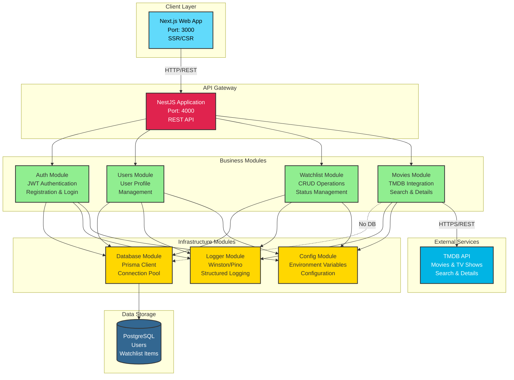

### 1. Діаграма компонентів системи

```mermaid
graph TB
    subgraph "Client Layer"
        NextJS[Next.js Web App<br/>Port: 3000<br/>SSR/CSR]
    end
    
    subgraph "API Gateway"
        Gateway[NestJS Application<br/>Port: 4000<br/>REST API]
    end
    
    subgraph "Business Modules"
        Auth[Auth Module<br/>JWT Authentication<br/>Registration & Login]
        Users[Users Module<br/>User Profile<br/>Management]
        Watchlist[Watchlist Module<br/>CRUD Operations<br/>Status Management]
        Movies[Movies Module<br/>TMDB Integration<br/>Search & Details]
    end
    
    subgraph "Infrastructure Modules"
        Logger[Logger Module<br/>Winston/Pino<br/>Structured Logging]
        Config[Config Module<br/>Environment Variables<br/>Configuration]
        DBModule[Database Module<br/>Prisma Client<br/>Connection Pool]
    end
    
    subgraph "Data Storage"
        PG[(PostgreSQL<br/>Users<br/>Watchlist Items)]
    end
    
    subgraph "External Services"
        TMDB[TMDB API<br/>Movies & TV Shows<br/>Search & Details]
    end
    
    NextJS -->|HTTP/REST| Gateway
    
    Gateway --> Auth
    Gateway --> Users
    Gateway --> Watchlist
    Gateway --> Movies
    
    Auth --> DBModule
    Users --> DBModule
    Watchlist --> DBModule
    Movies -.->|No DB| DBModule
    
    Auth --> Logger
    Users --> Logger
    Watchlist --> Logger
    Movies --> Logger
    
    Auth --> Config
    Users --> Config
    Watchlist --> Config
    Movies --> Config
    
    DBModule --> PG
    
    Movies -->|HTTPS/REST| TMDB
    
    style NextJS fill:#61dafb,stroke:#333,stroke-width:2px,color:#000
    style Gateway fill:#e0234e,stroke:#333,stroke-width:2px,color:#fff
    style Auth fill:#90ee90,stroke:#333,stroke-width:2px
    style Users fill:#90ee90,stroke:#333,stroke-width:2px
    style Watchlist fill:#90ee90,stroke:#333,stroke-width:2px
    style Movies fill:#90ee90,stroke:#333,stroke-width:2px
    style Logger fill:#ffd700,stroke:#333,stroke-width:2px
    style Config fill:#ffd700,stroke:#333,stroke-width:2px
    style DBModule fill:#ffd700,stroke:#333,stroke-width:2px
    style PG fill:#336791,stroke:#333,stroke-width:2px,color:#fff
    style TMDB fill:#01b4e4,stroke:#333,stroke-width:2px,color:#fff

```